#### Spatial Ecology in R 2025                               


---

## Introdution

### Study Area and Background

The Chongqing municipality in southwestern China experienced an unprecedented 
extreme heat and drought event in the summer of 2022, characterised by record-breaking temperatures exceeding 45°C in some districts and a prolong precipitation deficit compared to the historical average. The average temperature in August 2022 reached 35°C, which is the highest in the past 30 years. This compound climate extreme even triggered wildfires across the region between mid-August and late August 2022.

  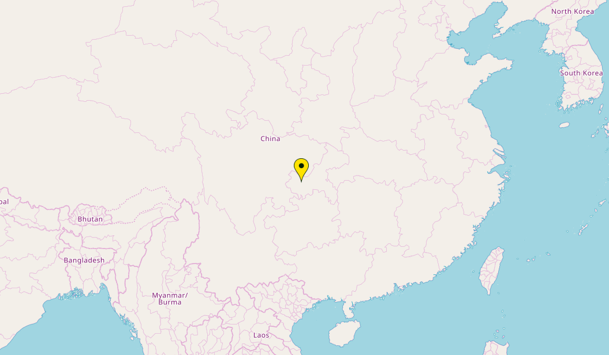

The study area covers a Sentinel-2 tile encompassing the south region of the municipality, including mountainous terrain, river valleys, and urban areas. 
The tile provides a representative sample of the broader regional vegetation response to the 2022 extreme event, capturing a range of land cover types and topographic conditions.

### Objectives

This project uses Sentinel-2 multispectral imagery and the R programming environment to investigate vegetation dynamics in the study area in relation to the 2022 
extreme heat and drought event. Two complementary analyses are conducted:

**Section 01** examines the intra-annual vegetation change within 2022, comparing 
pre-drought conditions (July 2022) with peak drought conditions (August 2022, before the wildfires) through spectral band visualisation, DVI, NDVI calculation, land cover classification, and distribution analysis.

**Section 02** extends the analysis to an inter-annual perspective, comparing August NDVI across four years (2020, 2021, 2022, 2024) to assess whether the 2022 vegetation state represents a genuine anomaly relative to non-drought reference years, and to examine the spatial extent of post-drought recovery by 2024.


---

## Data Collection and Working Environment Setup

### Image download
The imagery were downloaded through the [Copernicus Data Space Ecosystem](https://dataspace.copernicus.eu/) website, choosing the area described above.<br>

All imagery was sourced from the Sentinel-2 Level-2A (L2A) product, providing 
atmospherically corrected surface reflectance values. Cloud cover was kept below 3% for all selected scenes.

All imagery are provided as separate spectral bands at 20 m resolution (R20).  

The bands images include Band 2 (blue), Band 3 (green), Band 4 (red), and Band 8A (narrow near-infrared). 

Since the data are at 20 m resolution, Band 8A is used instead of the native 10 m Band 8.


### Loading packages
````md
library(terra)
library(viridis)
library(imageRy)
library(ggplot2)
library(gridExtra) 
````
### Setting the working directory
````md
setwd("/Users/depp/Unibo/Spatial_Ecology_in_R")
````
### Defining color palettes
````md
cols1 <- hcl.colors(100, "Viridis")
cols2 <- hcl.colors(100, "RdYlGn")
````

---

## 01 Investigating the vegetation degradation in 2022 summer 
### Importing Sentinel-2 Images

The Sentinel-2 imagery used in this section covers the study area for two time periods: July and August 2022. 

````md
b2_2022_07 <- rast("20220707_B02.jp2")
b3_2022_07 <- rast("20220707_B03.jp2")
b4_2022_07 <- rast("20220707_B04.jp2")
b8_2022_07 <- rast("20220707_B8A.jp2")

b2_2022_08 <- rast("20220811_B02.jp2")
b3_2022_08 <- rast("20220811_B03.jp2")
b4_2022_08 <- rast("20220811_B04.jp2")
b8_2022_08 <- rast("20220811_B8A.jp2")
 ````

### Visualizing individual spectral bands

Displaying the four spectral bands (B2, B3, B4, B8A) allow visual inspection of raw reflectance.

Based on the inspection of potential outliers, a range parameter of 0–8000 (for visible bands) and 0–10000 (for NIR) was applied to enhance visual contrast for reflectance value inspection. 

 ````md    
par(mfrow = c(2, 4))
plot(b2_2022_07, col = cols1, range = c(0,8000), main = "B2 202207")
plot(b3_2022_07, col = cols1, range = c(0,8000), main = "B3 202207")
plot(b4_2022_07, col = cols1, range = c(0,8000), main = "B4 202207")
plot(b8_2022_07, col = cols1, range = c(0,10000), main = "B8 202207")

plot(b2_2022_08, col = cols1, range = c(0,8000), main = "B2 202208")
plot(b3_2022_08, col = cols1, range = c(0,8000), main = "B3 202208")
plot(b4_2022_08, col = cols1, range = c(0,8000), main = "B4 202208")
plot(b8_2022_08, col = cols1, range = c(0,10000), main = "B8 202208")
   ````
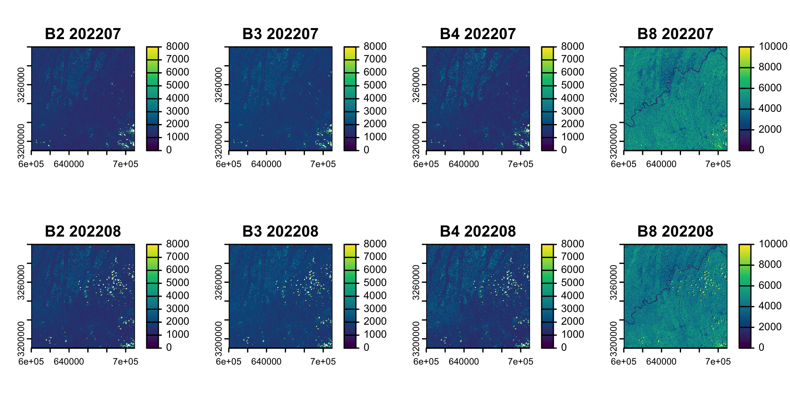

> **💡**  
>  
> B8 (NIR) shows a darkening trend in August, while B4 (Red) exhibits a noticeable brightening. Changes in other spectral bands are not significant. The concurrent B4 brightening and B8 darkening are consistent with chlorophyll degradation and canopy structural damage under heat and drought stress.


### Composing Multi-Band rasters

The individual spectral bands (B2, B3, B4, B8A) were combined into multi-layer SpatRaster objects for July and August 2022 using the c() function. <br>

The bands were ordered as Red (B4), Green (B3), Blue (B2), and Near-Infrared (B8A) to facilitate subsequent NDVI calculation and true-color RGB visualization.

 ````md
img_2022_07 <- c(b4_2022_07, b3_2022_07, b2_2022_07, b8_2022_07)
img_2022_08 <- c(b4_2022_08, b3_2022_08, b2_2022_08, b8_2022_08)
 ````

### True color display (RGB)
Creating a multiframe panel to display the images of July and August.<br> 
Using the im.plotRGB() function from the imageRy package. <br>
NIR is not displayed.

 ````md
layout(matrix(c(1, 0, 2), nrow = 1), widths = c(1, 0.5, 1)) 
im.plotRGB(img_2022_07, r=1, g=2, b=3, title="2022_07")
im.plotRGB(img_2022_08, r=1, g=2, b=3, title="2022_08")
 ````
<p align="center">
  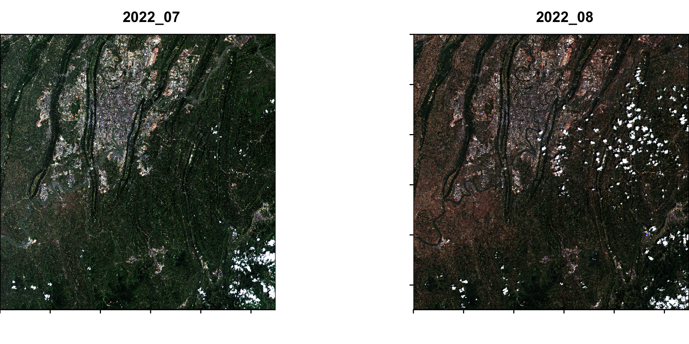
</p>

> **💡**  
>  
> From July to August, certain areas are visibly shifting from green to yellowish-brown, indicating vegetation senescence apparent to the naked eye. The urban/bare land areas in the upper-left corner appear light white and remain relatively stable.

### False color display
False color (NIR, Red, Green) display highlights vegetation in red

 ````md
layout(matrix(c(1, 0, 2), nrow = 1), widths = c(1, 0.5, 1)) 
im.plotRGB(img_2022_07, r=4, g=1, b=2, title="2022_07")
im.plotRGB(img_2022_08, r=4, g=1, b=2, title="2022_08") 
 ````

<p align="center">
  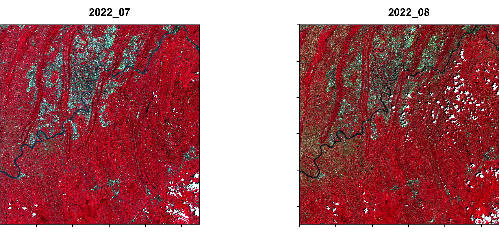
</p>

  
> **💡**  
>  
> From July to August, the left plain/valley trough areas have largely faded to dark red or brownish-red, indicating a sharp decline in NIR reflectance. The mountain area in the lower-right corner, however, retains bright red, demonstrating spatial heterogeneity. 
> 
> The region's typical "parallel ridge-valley" topography is clearly visible, with sparse vegetation in the valleys and dense, lush vegetation on the ridges. Under drought stress, the valley troughs experience heat accumulation and strong water evaporation, leading to particularly severe vegetation degradation.
> 
> Clouds appear as white speckles and can be ignored.

### DVI analysis

The Difference Vegetation Index (DVI) is one of the simplest and earliest vegetation indices, calculated as the arithmetic difference between near-infrared (NIR) and red reflectance as below . :   
$` DVI = NIR - Red `$   
It directly measures the contrast between high NIR reflectance and low red reflectance characteristic of healthy green vegetation, without normalization.

 ````md
# Calculate DVI for both periods and compare their difference in a single composite image
dvi_2022_07 <- (b8_2022_07 - b4_2022_07) 
dvi_2022_08 <- (b8_2022_08 - b4_2022_08) 

dvi_diff08 <- dvi_2022_08 - dvi_2022_07

par(mfrow=c(1,3))
plot(ndvi_2022_07, col=cols1, main="DVI 202207")
plot(ndvi_2022_08, col=cols1, main="DVI 202208")
plot(ndvi_diff08, col=cols2 , main="ΔDVI 202208 - 202207", range=c(-0.2, 0.2))
#a range parameter was applied to enhance visual contrast
 ````
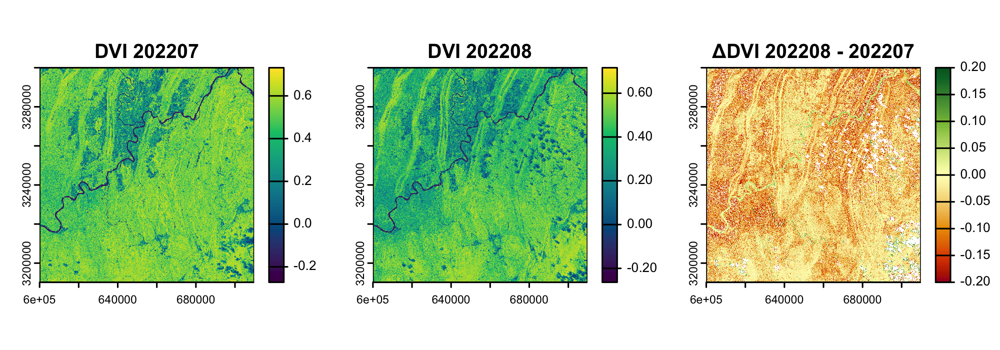

> **💡** 
>  
> DVI drops from 0.4–0.6 in July to lower values in August. ΔDVI reveals widespread negative values (−0.05 to −0.20), indicating vegetation decline. The striped pattern confirms valley troughs as the most degraded areas, while the lower-right mountains show minimal change. 
  
### NDVI analysis
The Normalized Difference Vegetation Index (NDVI) is a widely used metric for quantifying the health and density of vegetation using sensor data. 
It is calculated as:

$` NDVI = \frac{(NIR - Red)}{(NIR + Red)} `$   

The resulting values range from -1 to 1. <br>
Typical NDVI value ranges are: <br>
Water bodies: -0.1 to 0.1; <br>
Bare soil, rock, or urban areas: 0.1 to 0.2; <br>
Sparse vegetation (grasslands, shrubs): 0.2 to 0.5; <br>
Dense, healthy vegetation (forests, active crops): 0.5 to 0.9. <br>
These ranges can vary based on sensor characteristics, atmospheric conditions, and season.

 ````md
ndvi_2022_07 <- (b8_2022_07 - b4_2022_07) / (b8_2022_07 + b4_2022_07)
ndvi_2022_08 <- (b8_2022_08 - b4_2022_08) / (b8_2022_08 + b4_2022_08)

ndvi_diff08 <- ndvi_2022_08 - ndvi_2022_07

par(mfrow=c(1,3))
plot(ndvi_2022_07, col=cols1, main="NDVI 202207")
plot(ndvi_2022_08, col=cols1, main="NDVI 202208")
plot(ndvi_diff08, col=cols2 , main="ΔNDVI 202208 - 202207", range=c(-0.2, 0.2))
````

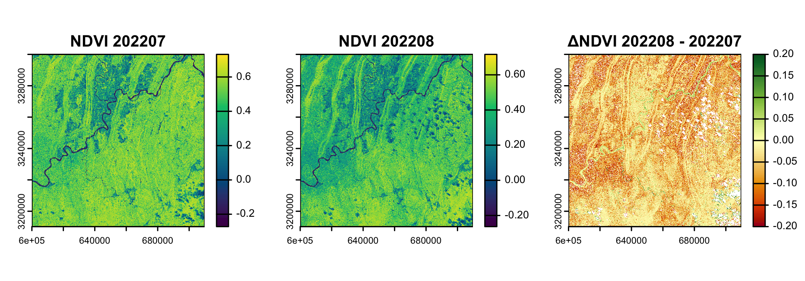

> **💡**
>  
> In this case, NDVI shows highly consistent results with DVI. 
> 
> ΔNDVI deepens the quantitative insight: deep orange-red stripes (−0.10 to −0.20) align with low-elevation valleys, while ridges and the lower-right mountainous area show smaller reductions. This topographically controlled pattern corroborates the DVI findings and confirms that heat and drought in enclosed valleys drove differential vegetation stress during the 2022 drought.

## Ridgeline plot

Ridgeline plot visualizing the shift in NDVI frequency distribution from July to August 2022.

````md
# Using the im.ridgeline() function from the imageRy package 
# Scale = 2 is used to emphasize the distributional shift.

im.ridgeline(c(ndvi_2022_07, ndvi_2022_08), scale = 2)
````

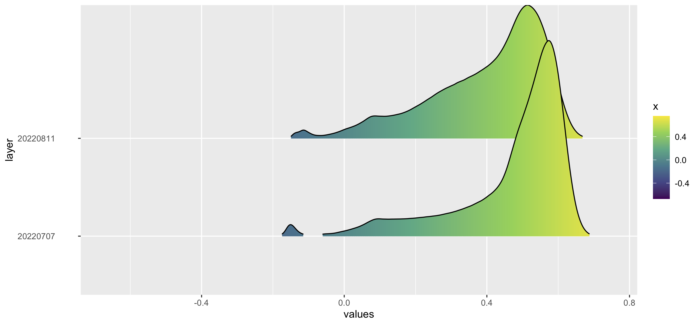

> **💡**
> 
> The NDVI peak shifts from ~0.55 in July to ~0.45 in August.
> 
> Since 0.5 is commonly considered the threshold for healthy vegetation, this leftward shift suggests a decline in healthy vegetation cover.


### Classification analysis
Two classification thresholds were selected to do classification analysis:<br>
- **0.3** is a widely used threshold for distinguishing moderate/dense vegetation from sparse/non-vegetated areas.<br>
- **0.4** was chosen based on the ridgeline plot, where a marked increase in pixel density is observed.

####  a.Threshold <- 0.3
 ````md
threshold <- 0.3  # NDVI threshold
# Classify NDVI into binary classes (0: non-vegetated, 1: vegetated) using terra::classify().
veg_map_07 <- classify(ndvi_2022_07, rcl = matrix(c(-Inf, threshold, 0, threshold, Inf, 1), ncol=3, byrow=TRUE))
veg_map_08 <- classify(ndvi_2022_08, rcl = matrix(c(-Inf, threshold, 0, threshold, Inf, 1), ncol=3, byrow=TRUE))

png("Classification_202207_202208.png", width = 2000, height = 700, res = 300)
par(mfrow = c(1, 2))
# 0 = Non-Vegetation(tan)
# 1 = Vegetation(darkgreen)
plot(veg_map_07, col = c("tan", "darkgreen"),main = "Classification 2022_07")
plot(veg_map_08, col = c("tan", "darkgreen"),main = "Classification 2022_08")
dev.off()
# Count valid (non-NA) pixels
valid_07 <- global(veg_map_07, fun = "notNA")[1,1]
valid_08 <- global(veg_map_08, fun = "notNA")[1,1]
# Count vegetated pixels (class == 1)
veg_07 <- global(veg_map_07 == 1, fun = "sum", na.rm = TRUE)[1,1]
veg_08 <- global(veg_map_08 == 1, fun = "sum", na.rm = TRUE)[1,1]
# Compute vegetation percentage
veg_percent_07 <- veg_07 / valid_07 * 100
veg_percent_08 <- veg_08 / valid_08 * 100
# Compute vegetation degradation
degradation0.3 = veg_percent_07-veg_percent_08
 ```` 
  
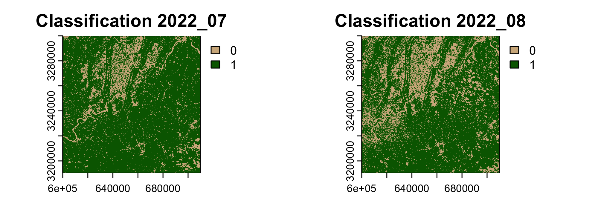

Bar plot of vegetation vs non-vegetation cover percentages (July vs August) using ggplot2.

 
 ````md
# Using ggplot2.
# Create data frame for plotting
plot_data <- data.frame(
  Month = rep(c("202207", "202208"), each = 2),
  Class = rep(c("Vegetation", "Non-Vegetation"), 2),
  Percentage = c(veg_percent_07, 100 - veg_percent_07,
                 veg_percent_08, 100 - veg_percent_08)
)
# Build grouped bar chart
ggplot(plot_data, aes(x = Month, y = Percentage, fill = Class)) +
  # Draw dodged columns
  geom_col(position = position_dodge(width = 0.7), width = 0.6) +
  # Add percentage labels above bars
  geom_text(aes(label = paste0(round(Percentage, 1), "%")),
            position = position_dodge(width = 0.7),
            vjust = -0.3, size = 4) +
  # Custom colors
  scale_fill_manual(values = c("Vegetation" = "#2E8B57", "Non-Vegetation" = "#D2B48C")) +
  labs(title = "Vegetation Cover  Classification (NDVI > 0.3)",
       x = NULL, y = "Area Percentage (%)") +
  # Apply minimal theme
  theme_minimal(base_size = 13) +
  theme(legend.title = element_blank(),
        legend.position = "top",
        plot.title = element_text(hjust = 0.5, face = "bold"))
# Export plot
ggsave("Vegetation_Comparison0.3.png", width = 8, height = 6, dpi = 300)
 ```` 

<p align="center">
  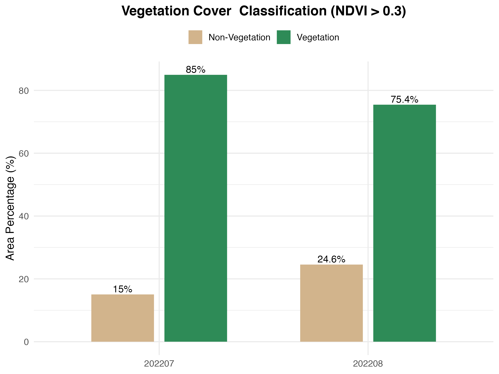
</p>

|Class(Threshold ≥ 0.3) | 202207 | 202208 | Degradation
|:----------|:----------|:----------|:----------|
| Non-Vegetation        | 15        | 24.6        |-
| Vegetation        | 85        | 75.4        |9.6

> **💡**
> 
> The binary classification maps reveal an evident increase in non-vegetation (tan) areas between July and August. <br>
Subsequent calculations provided the exact vegetation coverage values for both months and the degradation rate.

####  b.Threshold <- 0.4

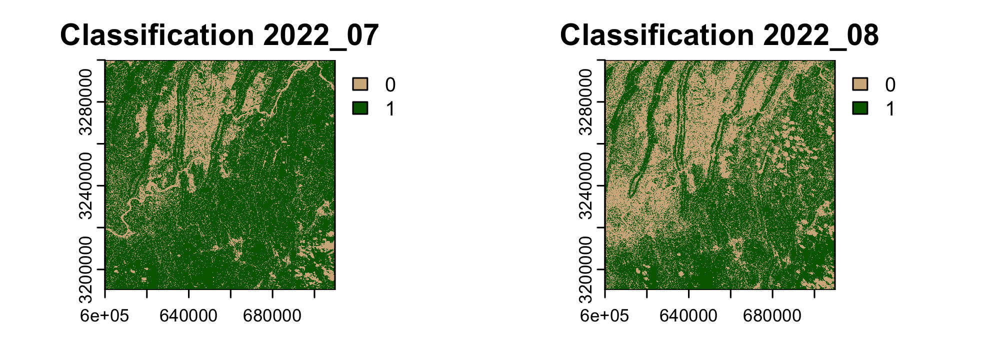

> **💡**
> 
> At a threshold of 0.4, the degraded area increased substantially. <br>
The spatial pattern shows that vegetation degradation was mainly distributed in the upper-left part of the study area, with a diagonal trend corresponding to the river direction. <br>
This suggests that vegetation along the river corridor and in the upper-left region was more affected by heat and drought.

<p align="center">
  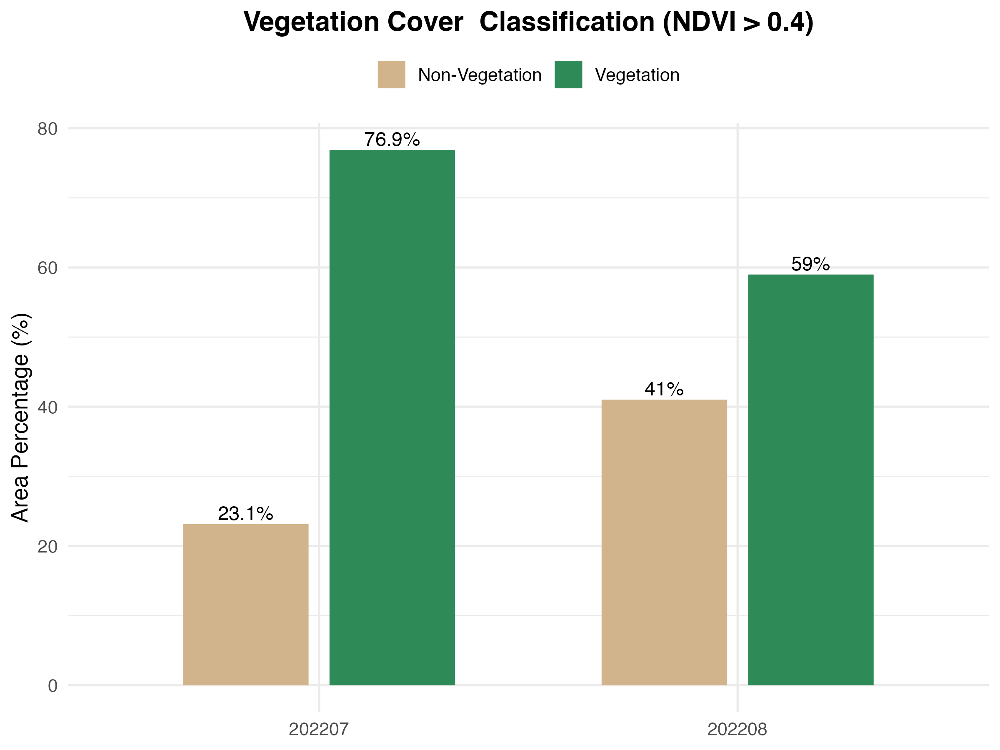
</p>


|Class(Threshold ≥ 0.4) | 202207 | 202208 | Degradation
|:----------|:----------|:----------|:----------|
| Non-Vegetation        | 23.1        | 41        |-
| Vegetation        | 76.9        | 59        |17.9

> **💡**
> 
> When the threshold was set at 0.3, vegetation coverage declined by 9.5% from July to August. <br>
Increasing the threshold to 0.4 yielded a degradation rate of 17.9%, a marked increase. <br>
This indicates that healthier vegetation was more vulnerable to degradation under prolonged heat and drought stress. 


####  c.Threshold effects

Degradation rates for thresholds of 0.2, 0.5, and 0.6 were also calculated, using the same analytical procedures (code not shown), to examine the threshold dependency of this pattern. <br>

The results are visualized in the accompanying table and bar chart.

| Threshold | ≥ 0.2 | ≥ 0.3 | ≥ 0.4 | ≥ 0.5 | ≥ 0.6 |
|:-----------|:-------|:-------|:-------|:-------|:-------|
| Degradation | 3.6 | 9.5 | 17.9 | 25.2 | 9.8 |       

<p align="center">
  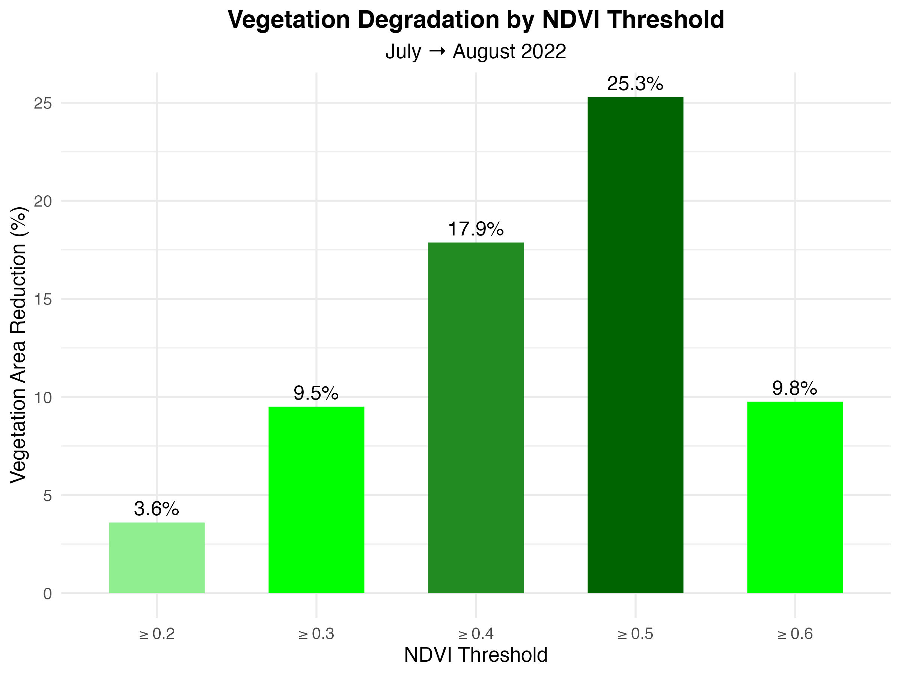
</p>

> **💡**
> 
> The highest degradation value (25.2%) was observed at a threshold of 0.5, suggesting a significant loss of healthy vegetation cover.

### Severe degradation and dense vegetation areas

Severe degradation areas were identified based on two criteria: a relatively high NDVI value in July (NDVI > 0.4) and a significant NDVI decrease in August (NDVI difference < -0.15). Pixels meeting both conditions were classified as severely degraded areas.

July dense vegetation areas (NDVI > 0.6) were mapped for comparison with severe degradation areas.

 ````md
high_veg_cover <- ndvi_2022_07 > 0.6 
severe_degradation <- ndvi_2022_07 > 0.4 & ndvi_diff08 < -0.15
png("NDVI_Severe_Degradation_Area.png", width=2000, height=1000, res=300)
par(mfrow = c(1, 2))
plot(severe_degradation, main = "NDVI Severe Degradation Area")
plot(high_veg_cover, main = "Dense Vegetation Cover Area")
dev.off()
 ```` 
 
<p align="center">
  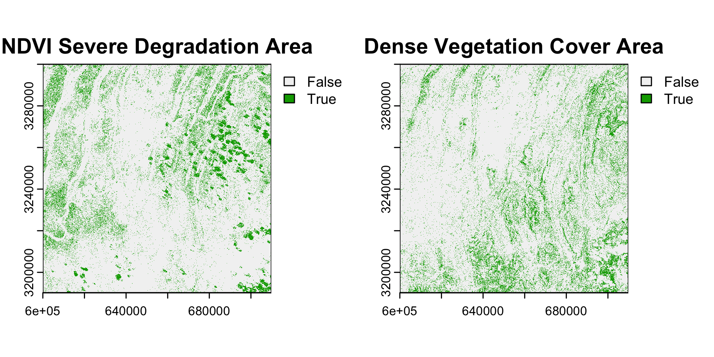
</p>

> **💡**
> 
> The severe degradation areas were mainly concentrated around the urban area and along the river corridor, particularly in the upper-left valleys part. This spatial pattern suggests that vegetation in these regions was more vulnerable to heat and drought stress. 
> 
> This result could be related to the urban heat island effect, while vegetation along the river corridor may be more sensitive to changes in local water availability. 
> 
> In contrast, the dense vegetation areas identified in July (NDVI > 0.6) showed relatively limited degradation. This may indicate stronger resistance to heat and drought stress, possibly due to differences in vegetation characteristics and water availability.

---

## 02 Inter-annual Comparison of August Vegetation State (2020–2024)

The previous section demonstrated a significant decline in vegetation NDVI between July and August 2022, coinciding with the extreme heat and drought event recorded in study area that summer. 

To assess whether this decline represents a genuine anomaly rather than normal seasonal or inter-annual variability, this section extends the analysis to include August imagery from 2020, 2021, and 2024 as reference years.

The year 2023 was excluded due to the absence of Sentinel-2 scenes with acceptable cloud cover (< 5%) during August.

### Data import and band composition
<details>
  <summary>Click to expand: Codes for Data Import and Band Composition</summary>
  
 ````md
# Importing Sentinel-2 Images
b2_2020 <- rast("20200826_B02.jp2")
b3_2020 <- rast("20200826_B03.jp2")
b4_2020 <- rast("20200826_B04.jp2")
b8_2020 <- rast("20200826_B8A.jp2")

b2_2021 <- rast("20210801_B02.jp2")
b3_2021 <- rast("20210801_B03.jp2")
b4_2021 <- rast("20210801_B04.jp2")
b8_2021 <- rast("20210801_B8A.jp2")

b2_2022 <- rast("20220811_B02.jp2")
b3_2022 <- rast("20220811_B03.jp2")
b4_2022 <- rast("20220811_B04.jp2")
b8_2022 <- rast("20220811_B8A.jp2")

b2_2024 <- rast("20240820_B02.jp2")
b3_2024 <- rast("20240820_B03.jp2")
b4_2024 <- rast("20240820_B04.jp2")
b8_2024 <- rast("20240820_B8A.jp2")

# Composing Multi-Band Rasters
img_2020 <- c(b4_2020, b3_2020, b2_2020, b8_2020)
img_2021 <- c(b4_2021, b3_2021, b2_2021, b8_2021)
img_2022 <- c(b4_2022, b3_2022, b2_2022, b8_2022)
img_2024 <- c(b4_2024, b3_2024, b2_2024, b8_2024)

 ````

<details>

### True & False color display

<details>
  <summary>Click to expand: Codes for True & False color display</summary>
  
 ````md
# True color display
png("yearsplot.png", width=2000, height=700, res=300)
# layout images separately
layout(matrix(c(1, 0, 2, 0, 3, 0, 4), nrow = 1), widths = c(1, 0.1, 1, 0.1, 1, 0.1, 1))

im.plotRGB(img_2020, r=1, g=2, b=3, title="2020")
im.plotRGB(img_2021, r=1, g=2, b=3, title="2021")
im.plotRGB(img_2022, r=1, g=2, b=3, title="2022")
im.plotRGB(img_2024, r=1, g=2, b=3, title="2024")

dev.off()

# False color display
png("yearsplot_falsecol.png", width=2000, height=700, res=300)
layout(matrix(c(1, 0, 2, 0, 3, 0, 4), nrow = 1), widths = c(1, 0.1, 1, 0.1, 1, 0.1, 1))

im.plotRGB(img_2020, r=4, g=1, b=2, title="2020")
im.plotRGB(img_2021, r=4, g=1, b=2, title="2021")
im.plotRGB(img_2022, r=4, g=1, b=2, title="2022")
im.plotRGB(img_2024, r=4, g=1, b=2, title="2024")

dev.off()
 ````
 
<details>


### 

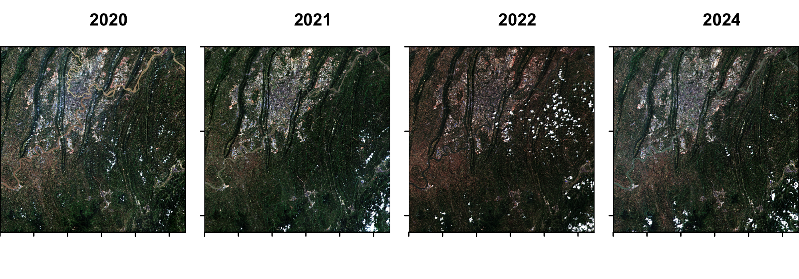

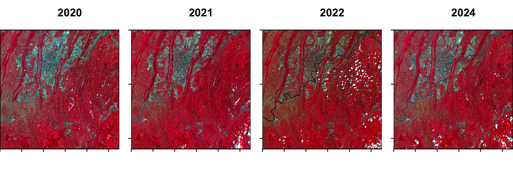

### NDVI analysis
<details>
  <summary>Click to expand: Codes for True & False color display</summary>
  
 ````md
# Calculate NDVI of every year
ndvi_2020 <- (b8_2020 - b4_2020) / (b8_2020 + b4_2020)
ndvi_2021 <- (b8_2021 - b4_2021) / (b8_2021 + b4_2021)
ndvi_2022 <- (b8_2022 - b4_2022) / (b8_2022 + b4_2022)
ndvi_2024 <- (b8_2024 - b4_2024) / (b8_2024 + b4_2024)

# NDVI Comparison Map
png("years_NVDI.png", width=2000, height=700, res=300)
par(mfrow=c(1,4))

plot(ndvi_2020, col=cols1, main="NDVI 2020")
plot(ndvi_2021, col=cols1, main="NDVI 2021")
plot(ndvi_2022, col=cols1, main="NDVI 2022")
plot(ndvi_2024, col=cols1, main="NDVI 2024")
dev.off()

# Inter-annual NDVI Difference Maps
ndvi_diff20 <- ndvi_2020 - ndvi_2022
ndvi_diff21 <- ndvi_2021 - ndvi_2022
ndvi_diff24 <- ndvi_2024 - ndvi_2022

png("years_NVDI_diff.png", width=2000, height=700, res=300)
par(mfrow=c(1,3))

plot(ndvi_diff20, col=cols2 , main="ΔNDVI 2020 - 2022", range=c(-0.2, 0.2))
plot(ndvi_diff21, col=cols2 , main="ΔNDVI 2021 - 2022", range=c(-0.2, 0.2))
plot(ndvi_diff24, col=cols2 , main="ΔNDVI 2024 - 2022", range=c(-0.2, 0.2))

dev.off() 
 ````
 
<details>

### 

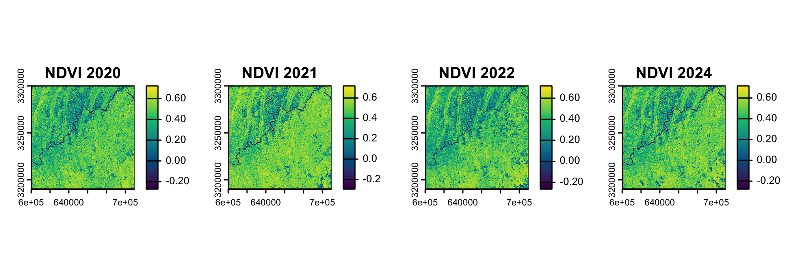

<p align="center">
  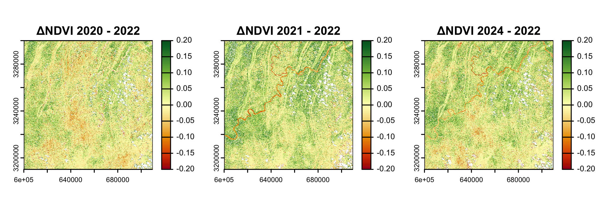
</p>

> **💡**
> 
> The 2022 NDVI map is visibly darker than 2020, 2021, and 2024, indicating lower overall vegetation vigor. 
> 
> The difference maps show widespread positive values when subtracting 2022, confirming that all three years outperformed the drought year. The 2021–2022 contrast is the most pronounced, with the largest and most intense green areas, suggesting 2021 had particularly favorable vegetation conditions. 

### Classification analysis
For the inter-annual comparison, a threshold of NDVI = 0.3 was applied, following the commonly used boundary between sparse and moderate-to-dense vegetation cover.

<details>
  <summary>Click to expand: Codes for Classification Analysis</summary>

 ````md  
 
 threshold <- 0.3  
# A threshold of NDVI = 0.3 was applied following the commonly used 
# boundary between sparse and moderate-to-dense vegetation cover.

veg_map_2020 <- classify(ndvi_2020, rcl = matrix(c(-Inf, threshold, 0, threshold, Inf, 1), ncol=3, byrow=TRUE))
veg_map_2021 <- classify(ndvi_2021, rcl = matrix(c(-Inf, threshold, 0, threshold, Inf, 1), ncol=3, byrow=TRUE))
veg_map_2022 <- classify(ndvi_2022, rcl = matrix(c(-Inf, threshold, 0, threshold, Inf, 1), ncol=3, byrow=TRUE))
veg_map_2024 <- classify(ndvi_2024, rcl = matrix(c(-Inf, threshold, 0, threshold, Inf, 1), ncol=3, byrow=TRUE))

# plot classification maps
png("Classification_years.png", width = 2000, height = 700, res = 300)
par(mfrow = c(1, 4))

plot(veg_map_2020, col = c("tan", "darkgreen"), main = "2020")
plot(veg_map_2021, col = c("tan", "darkgreen"), main = "2021")
plot(veg_map_2022, col = c("tan", "darkgreen"), main = "2022")
plot(veg_map_2024, col = c("tan", "darkgreen"), main = "2024")

dev.off()

# Count valid (non-NA) pixels
valid_2020 <- global(veg_map_2020, fun = "notNA")[1,1]
valid_2021 <- global(veg_map_2021, fun = "notNA")[1,1]
valid_2022 <- global(veg_map_2022, fun = "notNA")[1,1]
valid_2024 <- global(veg_map_2024, fun = "notNA")[1,1]

# Count vegetated pixels (class == 1)
veg_2020 <- global(veg_map_2020 == 1, fun = "sum", na.rm = TRUE)[1,1]
veg_2021 <- global(veg_map_2021 == 1, fun = "sum", na.rm = TRUE)[1,1]
veg_2022 <- global(veg_map_2022 == 1, fun = "sum", na.rm = TRUE)[1,1]
veg_2024 <- global(veg_map_2024 == 1, fun = "sum", na.rm = TRUE)[1,1]

# Compute vegetation percentage
veg_percent_2020 <- veg_2020 / valid_2020 * 100
veg_percent_2021 <- veg_2021 / valid_2021 * 100
veg_percent_2022 <- veg_2022 / valid_2022 * 100
veg_percent_2024 <- veg_2024 / valid_2020 * 100
 
 
 ````
<details> 

### 

<p align="center">
  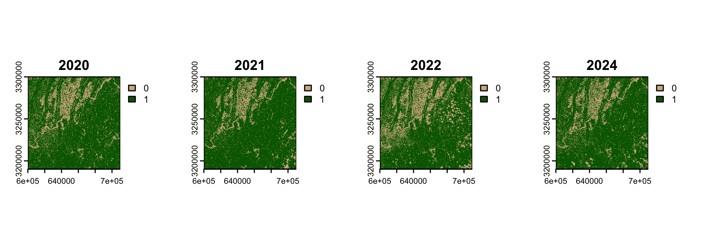
</p>

> **💡**
> 
> The non-vegetated (tan) areas in 2022 are markedly more extensive.


### Vegetation coverage statistics

 ````md 
# Organise vegetation coverage statistics into a data frame for visualisation
years <- c("2020", "2021", "2022", "2024")
veg_percent_all <- c(veg_percent_2020, veg_percent_2021, veg_percent_2022, veg_percent_2024)
veg_df <- data.frame(year = years, veg_percent = veg_percent_all)

# Bar chart: vegetation coverage (%) by year; 2022 highlighted in red
p1 <- ggplot(veg_df, aes(x = year, y = veg_percent, fill = year)) +
  geom_col(width = 0.6) +
  geom_text(aes(label = sprintf("%.1f%%", veg_percent)), vjust = -0.5, size = 4.5) +
  scale_fill_manual(values = c("#66BB6A","#66BB6A","#D84315","#66BB6A")) +  # 2022 in different color
  labs(title = "Vegetation Coverage (%)", x = NULL, y = "Coverage (%)") +
  ylim(0, 100) +
  theme_minimal(base_size = 13) +
  theme(legend.position = "none",
        plot.margin = margin(t = 10, r = 50, b = 10, l = 10)) 

# Calculate mean NDVI for each year across all valid pixels
ndvi_means <- c(
  global(ndvi_2020, fun="mean", na.rm=TRUE)[1,1],
  global(ndvi_2021, fun="mean", na.rm=TRUE)[1,1],
  global(ndvi_2022, fun="mean", na.rm=TRUE)[1,1],
  global(ndvi_2024, fun="mean", na.rm=TRUE)[1,1]
)
names(ndvi_means) <- years

# Line chart: mean NDVI trend across years; 2022 highlighted in red
p2 <- ggplot(veg_df, aes(x = year, y = ndvi_means, group = 1)) +
  geom_line(color = "#2E7D32", linewidth = 1) +
  geom_point(aes(color = year), size = 4) +
  geom_text(aes(label = sprintf("%.3f", ndvi_means)), vjust = -1.2, size = 4) +
  scale_color_manual(values = c("#66BB6A","#66BB6A","#D84315","#66BB6A")) +
  labs(title = "Mean NDVI", x = NULL, y = "NDVI") +
  ylim(0.35, 0.48) +
  theme_minimal(base_size = 13) +
  theme(legend.position = "none",
        plot.margin = margin(t = 10, r = 10, b = 10, l = 50)) 

# Arrange plots side by side and export
# Using arrangeGrob() from the gridExtra package
g <- arrangeGrob(p1, p2, ncol = 2)
ggsave("veg_ndvi_years.png", g, width = 15, height = 5, dpi = 300)
 ````

| Year | Vegetation Coverage (%) | Non-vegetation Coverage (%) | Mean NDVI |
|:------|:------------------------|:-----------------------------|:-----------|
| 2020 | 81.0 | 19.0 | 0.421 |
| 2021 | 84.6 | 15.4 | 0.450 |
| 2022 | 75.4 | 24.6 | 0.399 |
| 2024 | 81.9 | 18.1 | 0.428 |

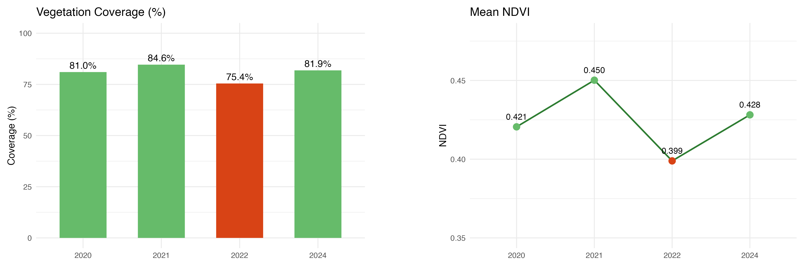

> **💡**
> 
> Both metrics identify 2022 as an outlier. Vegetation coverage drops to 75.4% (vs. ~81–85% in other years), and mean NDVI falls to 0.399 (vs. 0.421–0.450). The 2021 peak (84.6%, 0.450) provides the strongest contrast, confirming the severity of the 2022 drought. By 2024, both coverage and mean NDVI have largely recovered, though mean NDVI (0.428) remains slightly below the 2021 peak.

### Inter-annual SD analysis
The per-pixel standard deviation (SD) of NDVI was computed across the four August scenes using the `app()` function from the `terra` package, to identify which areas experienced the greatest year-to-year fluctuation in vegetation condition.

 ````md 
ndvi_stack <- c(ndvi_2020, ndvi_2021, ndvi_2022, ndvi_2024)
names(ndvi_stack) <- c("2020", "2021", "2022", "2024")

# Calculate per-pixel SD of NDVI across four August scenes (2020, 2021, 2022, 2024)
ndvi_sd <- app(ndvi_stack, fun = sd)

png("NDVI_SD_interannual_range.png", width = 1400, height = 1200, res = 300)
plot(ndvi_sd, col = viridis(255, direction = -1), main = "NDVI Inter-annual SD", range = c(0, 0.2))
dev.off()
 ````

<p align="center">
  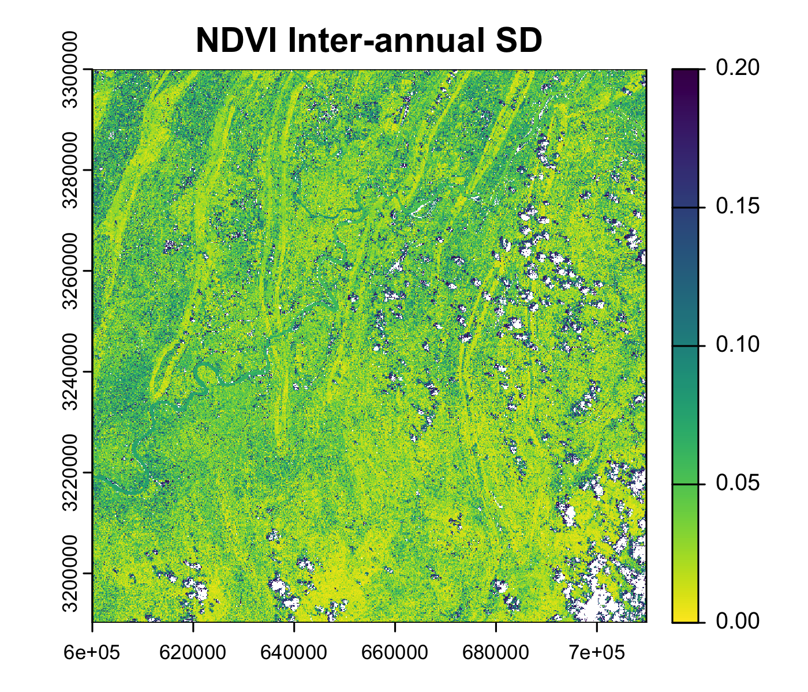
</p>

> **💡**
> 
> The per-pixel standard deviation reveals the spatial pattern of year-to-year vegetation variability. Higher SD values (dark blue, >0.10) concentrate in valley troughs, indicating these areas experienced the greatest fluctuation in vegetation condition，driven primarily by the 2022 drought anomaly. Lower SD values (yellow/green, <0.05) align with stable ridges and the lower-right mountainous area, confirming their resilience across years. 

### Post-drought vegetation recovery

To further examine the spatial extent of vegetation recovery following the 
2022 drought event, pixels were identified that simultaneously satisfied 
two conditions: a decline in NDVI between 2020 and 2022 (indicating 
drought-induced degradation), and a subsequent increase between 2022 and 
2024 (indicating partial recovery). 

This binary classification highlights 
areas where vegetation showed clear evidence of both impact and recovery 
within the study period.

 ````md 
recovered_area <- ndvi_2022 < ndvi_2020 & ndvi_2024 > ndvi_2022
png("NDVI_recovered_area.png", width=1400, height=1200, res=300)
plot(recovered_area, main = "NDVI Recovered Area")
dev.off()
 ````
<p align="center">
  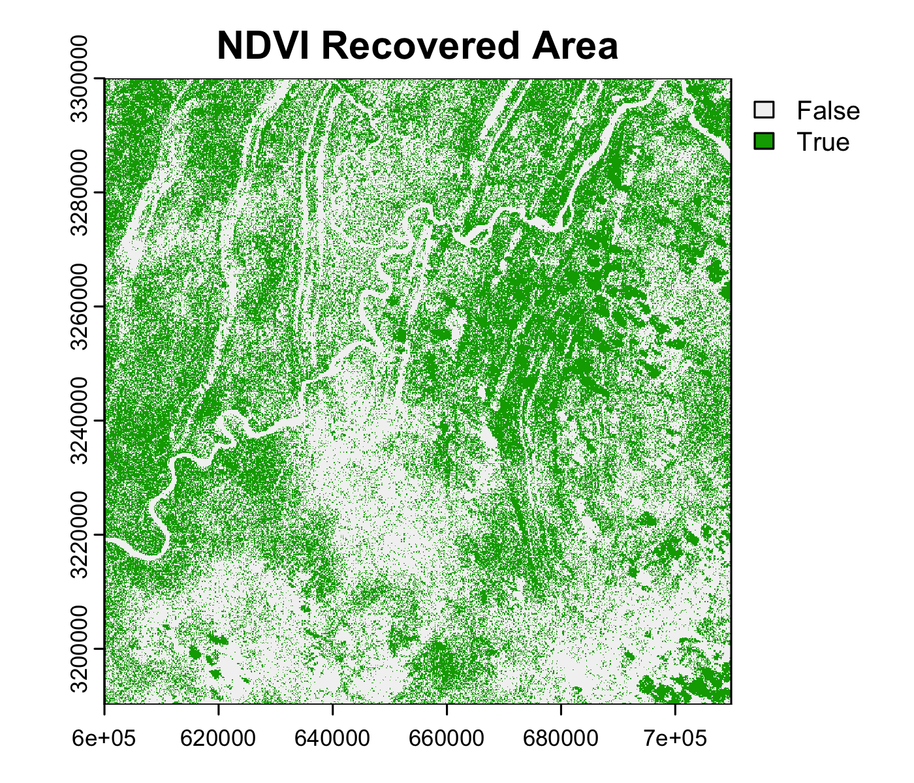
</p>

> **💡**
> 
> Pixels satisfying both degradation (2020→2022 decline) and recovery (2022→2024 increase) are mapped in green. Recovery is concentrated in valley troughs and low-elevation plains, while ridges and the lower-right mountainous area appear predominantly white (False). The white ridges reflect stable NDVI without severe degradation. The extensive white area in the lower portion indicates that this region , despite having healthy vegetation, experienced minimal drought impact in 2022 and thus lacked the prerequisite degradation for recovery, confirming its strong topographic resilience.

## Comment and Conclusion

This study demonstrates that the 2022 extreme heat and drought event in Chongqing caused severe and spatially heterogeneous vegetation degradation. 

Intra-annual analysis reveals a pronounced decline in NDVI from July to August 2022. The parallel ridge-valley topography strongly controlled the spatial pattern of impact: valley troughs experienced the most severe decline due to heat accumulation and moisture deficit, while ridges and higher-elevation areas remained relatively resilient.

Inter-annual comparison against reference years (2020, 2021, 2024) confirms 2022 as a clear outlier, with vegetation coverage and mean NDVI dropping substantially below other years. The inter-annual SD map further identifies valley troughs as the most variable and vulnerable zones. Post-drought recovery by 2024 was widespread but incomplete; areas that experienced both degradation and subsequent regeneration were concentrated in valleys, whereas topographically favored ridges and the lower-right mountainous area showed relatively stable NDVI throughout the study period. 

These findings highlight the critical role of topography in mediating vegetation response to compound climate extremes and underscore the differential resilience of landscape units within the same climatic event.
